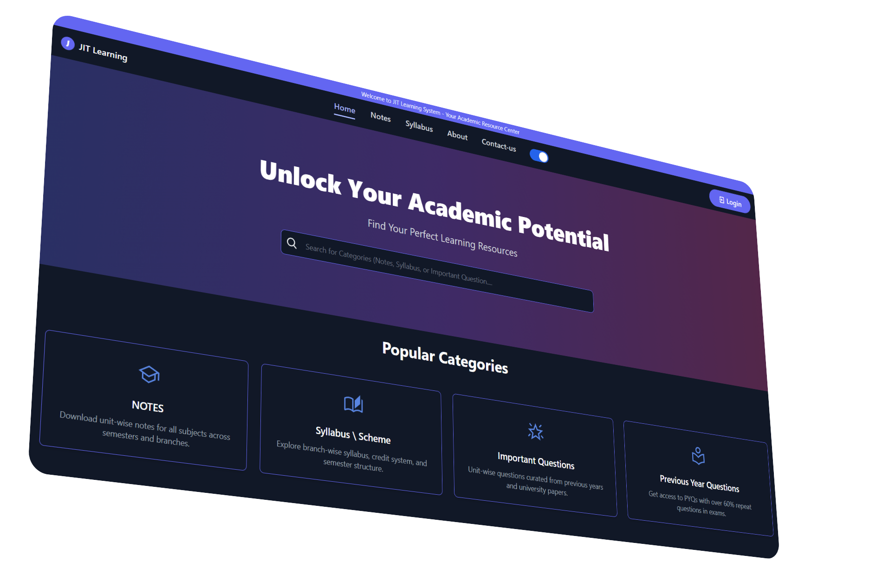

# 📒JIT Learning - Full-Stack Learning Management System 


<p align="center"><em>LMS-MERN: A full-stack Learning Management System with Authentication, Role-based Access, Notes Management, Cloudinary Integration, and Syllabus Uploads.</em></p>


[](https://github.com/abhishekkalme/LMS-MERN/blob/main/LICENSE)
[](https://github.com/abhishekkalme/LMS-MERN/commits/main)
[](https://github.com/abhishekkalme/LMS-MERN)
[](https://github.com/abhishekkalme/LMS-MERN)

<p align="left">Built with the tools and technologies:</p>

[](https://reactjs.org/)
[](https://vitejs.dev/)
[](https://tailwindcss.com/)
[](https://app.netlify.com/sites/lms-learning-management-system/deploys)
[](https://nodejs.org/)
[](https://expressjs.com/)
[](https://mongodb.com/)
[](https://tailwindcss.com/)
[](https://cloudinary.com/)
[](https://www.npmjs.com/)
</p>

---



💣 **Live Demo**: [https://lms-learning-management-system.netlify.app/](https://lms-learning-management-system.netlify.app/)

---
## 🔗 Quick Links


- [📍 Overview](#-Overview)
- [👾 Features](#-features)
- [🧠 Tech Stack](#-Tech-Stack)
- [📁 Project Structure](#-project-structure)
- [🚀 Getting Started](#-getting-started)
  - [☑️ Prerequisites](#-prerequisites)
  - [⚙️ Installation](#-installation)
  - [🤖 Usage](#🤖-usage)
  - [🧪 Testing](#🧪-testing)
- [📌 Project Roadmap](#-project-roadmap)
- [🔰 Contributing](#-contributing)
- [🎗 License](#-license)
- [🙌 Acknowledgments](#-acknowledgments)
- [🤝 Connect](#-Connect)

---

## 📍 Overview

**LMS-MERN** is a full-featured Learning Management System for students and educators. It supports:

- Role-based access (Student, Teacher, Admin)
- Secure authentication (JWT, refresh tokens, OTP)
- Notes upload & approval
- Dynamic syllabus filters
- PDF previews with Cloudinary integration
- Dark/light theme support

---

## 👾 Features

- 👤 **User Authentication**: Secure login/signup with JWT, OTP verification.
- 🧑‍🏫 **Role Management**: Admin, Teacher, Student support.
- 🗂 **Notes Uploading & Downloading** with unit structure.
- 📚 **Syllabus Filters**: Based on branch, year, semester.
- 🖼 **PDF Preview Modal** (Cloudinary-hosted)
- 🔒 **Protected Routes** with refresh token auto-renewal.
- ☁️ **Cloudinary** structured uploads.

---


## 🧠 Tech Stack

| Layer         | Tech Used                         |
|---------------|-----------------------------------|
| Frontend      | React.js + Vite, Tailwind CSS     |
| Backend       | Node.js, Express.js               |
| Database      | MongoDB + Mongoose                |
| Auth          | JWT (Access + Refresh) + Cookies  |
| Cloud Storage | Cloudinary SDK                    |
| Email         | Gmail for OTP mails  |

## 📁 Project Structure

> See complete file tree in repo: [LMS-MERN](https://github.com/abhishekkalme/LMS-MERN)

````bash
LMS-MERN/
├── Backend/
│   ├── routes/, models/, config/, middleware/, utils/
│   └── index.js
├── Frontend/
│   ├── src/components/* (Admin, Notes, Auth, etc.)
│   ├── public/, assets/, context/
│   └── main.jsx, App.jsx
└── README.md
````


## 🚀 Getting Started

### ☑️ Prerequisites

Before getting started with LMS-MERN, ensure your runtime environment meets the following requirements:

- **Programming Language:** JavaScript
- **Package Manager:** Npm
- Node.js ≥ 18
- npm ≥ 9
- MongoDB instance
- Cloudinary credentials


### ⚙️ Installation

Install LMS-MERN using one of the following methods:

**Build from source:**

1. Clone the LMS-MERN repository:
```sh
❯ git clone https://github.com/abhishekkalme/LMS-MERN
````

2. Navigate to the project directory:

```sh
❯ cd LMS-MERN
```

3. Install the project dependencies:

**Using `npm`** &nbsp; [](https://www.npmjs.com/)

```sh
❯ cd Backend && npm install
> cd Frontend && npm install
```

### 🤖 Usage

Run LMS-MERN using the following command:
**Using `npm`** &nbsp; [](https://www.npmjs.com/)

```sh
❯ # In one terminal
cd Backend && npm run dev

# In another
cd Frontend && npm run dev

```
Visit http://localhost:5173 in your browser.


### 🧪 Testing

Run the test suite using the following command:
**Using `npm`** &nbsp; [](https://www.npmjs.com/)

```sh
❯ npm test
```

---

## 📌 Project Roadmap

- Setup Authentication (JWT + OTP + Email)

- PDF Uploading (Cloudinary with folder structure)

- Admin Approval + Feedback

- Role-based UI rendering

- AI-based note summaries (Upcoming 🚀)

- Download Analytics Dashboard


---

## 🔰 Contributing

- **💬 [Join the Discussions](https://github.com/abhishekkalme/LMS-MERN/discussions)**: Share your insights, provide feedback, or ask questions.
- **🐛 [Report Issues](https://github.com/abhishekkalme/LMS-MERN/issues)**: Submit bugs or feature requests.
- **💡 [Submit Pull Requests](https://github.com/abhishekkalme/LMS-MERN/blob/main/CONTRIBUTING.md)**: Review open PRs and submit your own.

<details closed>
 <summary>Contributing Guidelines</summary>

1. **Fork the Repository**: Start by forking the project repository to your github account.
2. **Clone Locally**: Clone the forked repository to your local machine using a git client.
   ```sh
   git clone https://github.com/abhishekkalme/LMS-MERN.git
   cd LMS-MERN
   ```
3. **Create a New Branch**: Always create a new branch for your changes.
   ```sh
   git checkout -b feature/your-feature-name

   ```
4. **Make Your Changes**: Implement the changes or fix the issue. Test thoroughly before committing.
5. **Commit Your Changes**: Commit with a clear message describing your updates.
   ```sh
   git add . 
   git commit -m "Add: Implemented feature XYZ"
   ```

6. **Push to Your Fork on GitHub**: Push your branch to your GitHub repository:


   ```sh
   git push origin feature/your-feature-name

   ```
7. **Open a Pull Request**: 
- Go to the original LMS-MERN repository.
- Click "Compare & pull request".
- Provide a meaningful PR title and description.
- Submit the pull request.

8. **Get Reviewed & Merged**: Wait for maintainers to review your PR. Once approved, it will be merged into the main branch.. ✅Congratulations on your contribution!
</details>

<details closed>
<summary>Contributor Graph</summary>
<br>
<p align="left">
  <a href="https://github.com/abhishekkalme/LMS-MERN/graphs/contributors">
    
  </a>
</p>
</details>


---

## 🎗 License

This project is protected under the [SELECT-A-LICENSE](https://github.com/abhishekkalme/LMS-MERN?tab=MIT-1-ov-file#) License. For more details, refer to the [LICENSE](https://github.com/abhishekkalme/LMS-MERN?tab=MIT-1-ov-file#) file.

---

## 🙌 Acknowledgments

 List any resources, contributors, inspiration, etc. here.
React

- [React](https://reactjs.org/)
- [Node.js](https://nodejs.org/)
- [MongoDB](https://www.mongodb.com/)
- [Cloudinary](https://cloudinary.com/)
- [Render](https://render.com/)
- [Netlify](https://netlify.com/)
- [RGPV Syllabus Data](https://www.rgpv.ac.in/)


---
### 🤝 Connect

- [LinkdIn](https://www.linkedin.com/in/abhishek-kalme-289a7430a/)

- [Email](mailto:abhishekkalme0@gmail.com)
---
